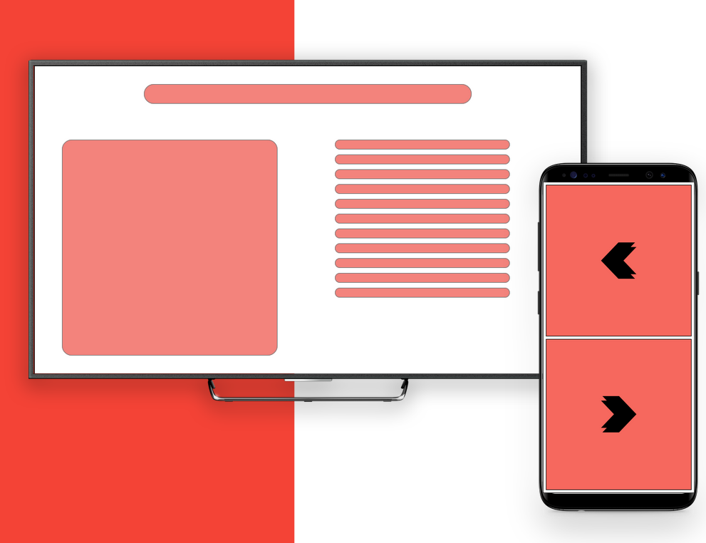
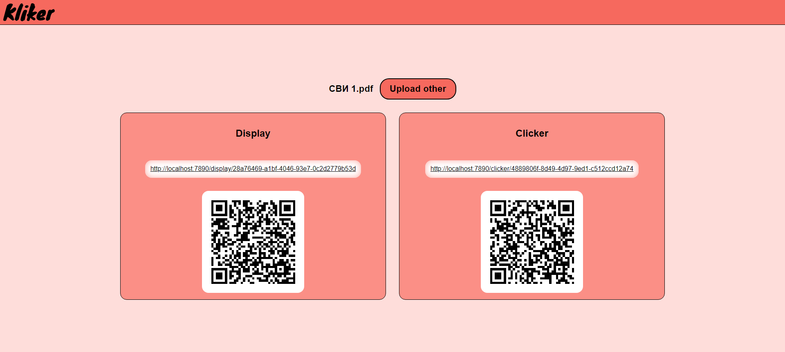
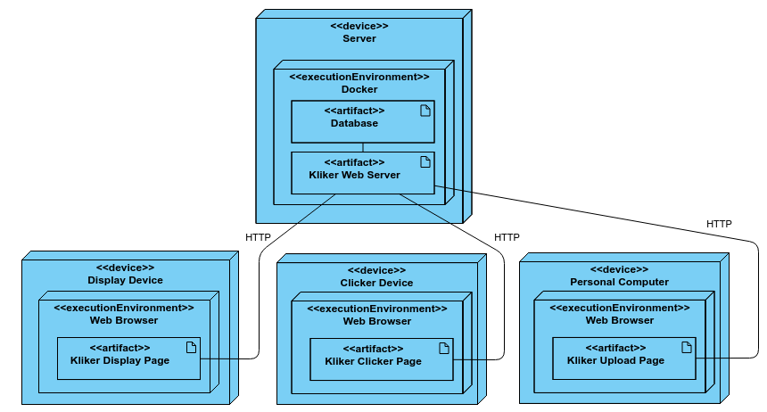
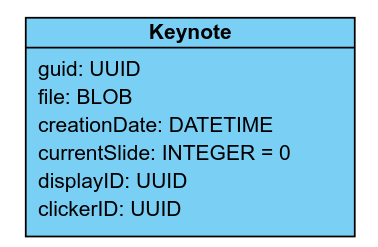
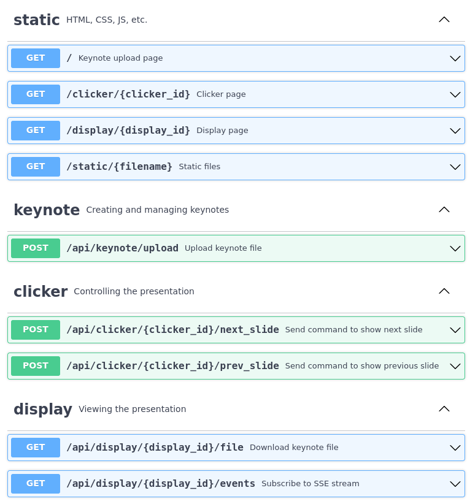

### Сервис для выступлений с презентациями с кликером.

**Авторы:** бэкенд [@gvsem](https://github.com/gvsem), фронтенд [@jvstme](https://github.com/jvstme), тестирование [@Sactive4](https://github.com/Sactive4).


### Запуск сервера

#### На хостовой системе

Для запуска понадобится Java 17 или выше. Запустить сервис можно командой:

```shell
mvn spring-boot:run
```

Вы можете настроить приложение в [`application.properties`](https://github.com/gvsem/kliker/blob/master/src/main/resources/application.properties)

Порт по умолчанию: `7890`.

#### В Docker-контейнере

Вы можете вручную собрать образ и запустить development-версию сервиса без постоянного хранения данных:

```shell
docker build -t kliker .
docker run -p 7890:7890 kliker
```

## Описание системы



Kliker — это веб сервис для показа презентаций с помощью кликера. Пользователи заходя на сервис загружают презентацию и получают в ответ две ссылки: ссылка для устройства, с которого будет показываться презентация (дисплей), и устройства, с которого будут переключаться слайды (Кликер).

### Функциональные требования

Загрузка:
- Пользователь может загрузить на сервис презентацию в формате pdf.
- Пользователь получает 2 ссылки при успешной загрузке презентации. Одна ссылка на презентацию для открытия на дисплее, вторая для кликера.
- Пользователь получает сообщение об ошибке с описанием проблемы при неуспешности загрузки презентации.
- Ссылка на кликер не может быть восстановлена и открыта по ссылке на дисплей.

Дисплей:
- Дисплей отображает интерфейс для показа слайдов при открытии соответствующей ссылки
- Дисплей синхронизирован с кликером и показывает нужный слайд при подаче команд с кликера
- Дисплей имеет возможность отображать презентацию во весь экран
- Дисплей получает с сервера информацию о номере текущего слайда. При закрытии и повторном открытии презентация продолжается с текущего слайда, а не начинается с первого.
Ссылка для дисплея может быть открыта на нескольких устройствах. Все устройства синхронизированы и показывают один и тот же слайд.

Кликер:
- Кликер отображает интерфейс для управлениями слайдами при открытии соответсвующей ссылки
- Кликер синхронизирован с дисплеем и передает команды по управлению слайдами на дисплей
- Ссылка для кликера может быть открыта на нескольких устройствах.

### Нефункциональные требования

#### Надежность
Требуется минимизировать вероятность срыва выступления из-за отказа системы, в том числе по причине сбоя серверных компонентов и проблем со связью у пользователя.
#### Производительность
Основная метрика производительности — время отклика системы при переключении слайдов, т.е. время между нажатием кнопки на кликере и переключением слайда на системе. Требуется минимизировать время отклика за счет снижения задержек на серверной и клиентской части.
#### Поддерживаемость
Одним из вариантов использования системы будет её развёртывание на собственной инфраструктуре пользователя, поэтому требуется предусмотреть простой процесс развертывания, доступный людям с базовыми навыками системного администрирования, но без специальной подготовки. Также требуется разработка понятной документации по развертыванию.
#### Удобство использования
Требуется минимизировать количество требуемых от пользователя действий для загрузки, настройки и начала выступления с презентацией.

### Системная архитектура



С серверным компонентом взаимодействуют три типа устройств:

- **Устройство спикера.** С помощью веб-приложения пользователь загружает на сервер свою презентацию и получает ссылки на веб-страницу для дисплея и для кликера.
- **Кликер.** Планшет или мобильный телефон, на экране которого отображаются кнопки для переключения слайдов.
- **Дисплей.** Устройство, на котором в полный экран открыта страница демонстрации презентации, на которой в реальном времени переключаются слайды.

### Архитектура данных

Схема данных достаточно проста и состоит из одной сущности, экземпляр которой создается при загрузке новой презентации. Презентации присваивается уникальный идентификатор, а также идентификаторы для ссылок на дисплей и на кликер. Также хранятся такие метаданные, как дата создания и последний открытый слайд.



### Взаимодействие серверных и клиентских компонентов




### Отчет о тестировании

Целью тестирования веб-служб является проверка функциональности, надежности, производительности и безопасности API (интерфейса прикладных программ).

Загрузка:
- Пользователь может загрузить на сервис презентацию в формате pdf.
  - Зайти на сайт, нажать кнопку “Выберите файл”. При загрузке корректного pdf файла выдается 2 ссылки 
  - При загрузке некорректного файла (не pdf расширения, или битого pdf файла), выдается сообщение с информацией о проблеме 

- Пользователь получает 2 ссылки при успешной загрузке презентации. Одна ссылка на презентацию для открытия на дисплее, вторая для кликера.
  - При выборе и загрузке корректного pdf файла выдается 2 ссылки. Обе ссылки открываются - одна на начало pdf файла для демонстрации, вторая на кликер 
  - При возникновении проблем с генерацией ссылок, пользователь получает сообщение о возникших трудностях 
	
- Пользователь получает сообщение об ошибке с описанием проблемы при неуспешности загрузки презентации.
  - При возникновении проблем во время загрузки презентации, пользователь информируется о причине неуспешности загрузки, после чего презентацию можно загрузить вновь
- Ссылка на кликер не может быть восстановлена и открыта по ссылке на дисплей.
  - Ссылки на дисплей и кликер различны. Получить ссылку на кликер, заменив “display” на “кликер” не удается.


Дисплей:
- Дисплей отображает интерфейс для показа слайдов при открытии соответствующей ссылки
  - При первом открытии ссылки показывается начальный слайд 
- Дисплей синхронизирован с кликером и показывает нужный слайд при подаче команд с кликера
  - При нажатии кнопок переключения слайда кликере, на дисплее меняется слайд. 
- Дисплей имеет возможность отображать презентацию во весь экран
  - Презентация открывается во все окно браузера 

- Дисплей получает с сервера информацию о номере текущего слайда. При закрытии и повторном открытии презентация продолжается с текущего слайда, а не начинается с первого.
  - При перезагрузке или закрытии и открытии страницы, презентация продолжается с последнего открытого слайда 
  - При открытии ссылки в новом окне, показывается текущий слайд, а не сбрасывается и начинается с начала 
- Ссылка для дисплея может быть открыта на нескольких устройствах. Все устройства синхронизированы и показывают один и тот же слайд.
  - При открытии одной ссылки в разных окнах браузера (устройствах) показывается один и тот же слайд. 

Кликер:
- Кликер отображает интерфейс для управлениями слайдами при открытии соответсвующей ссылки
  - Отображаются кнопки для переключения слайдов вперед и назад 

Прочее:
- Время задержки при переключении слайдов незаметно глазу, нет видимого зависания 
- Кликер синхронизирован с дисплеем и передает команды по управлению слайдами на дисплей
  - При нажатии кнопок слайд меняется на дисплее в соответствии с поданной командой. При нажатии кнопки вперед показывается следующий слайд, при нажатии кнопки назад - предыдущий. 
  - При нажатии кнопки назад, находясь на 1 слайде, ничего не происходит, слайд остается прежним. Аналогично для последнего слайда, при нажатии кнопки вперед 
- Ссылка для кликера может быть открыта на нескольких устройствах.
  - Ссылка успешно открывается на разных устройствах 
